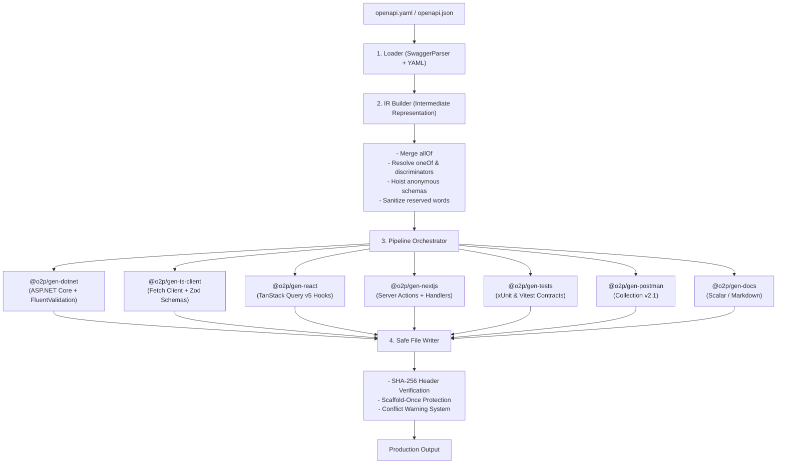

# openapi-to-production (`o2p`) ⚡

> **One `openapi.yaml` in → a production-grade, regenerable full-stack out.**  
> ASP.NET Core API, typed TypeScript client, TanStack React Query v5 hooks, Next.js Server Actions, DTOs, FluentValidation, xUnit contract tests, Postman collection, interactive documentation, and a realistic mock server.

[](https://github.com/almas-codes/openapi-to-production/actions)
[](https://opensource.org/licenses/MIT)
[](https://nodejs.org/)
[](https://dotnet.microsoft.com/)
[](https://www.typescriptlang.org/)
[](https://turbo.build/)

---

## Why I Built `o2p` (The Problem with Existing Generators)

If you have ever used **NSwag**, **openapi-generator**, or **AutoRest** on a large enterprise codebase, you have probably run into the exact same painful wall:

1. **They overwrite your business logic on regeneration.** You spend three weeks implementing custom endpoints, your team updates the OpenAPI spec, you run the generator, and half your files get clobbered or git-conflicted.
2. **They treat backend and frontend as completely isolated silos.** Your C# controller models and your TypeScript client models are generated by different tools using different naming rules, with zero shared validation or contract parity.
3. **They emit broken code.** Complex schemas (`allOf` inheritance, polymorphic `oneOf` with discriminators, nullable primitives across OpenAPI 3.0 vs 3.1) frequently spit out syntax errors that only fail when you hit compile.
4. **No drift detection in CI.** There is no native way to fail a pull request when hand-written code slips out of sync with the OpenAPI contract.

`o2p` redesigns the entire workflow around **Intermediate Representation (IR)**, **hash-protected safe regeneration**, and **compile-verified CI guarantees**.

---

## Key Highlights & Architectural Advantages

| Typical OpenAPI Generator | `o2p` (`openapi-to-production`) |
|---|---|
| Language-specific template strings | **Unified Intermediate Representation (IR)** — language-agnostic AST normalized once |
| Overwrites files or forces brittle git merges | **Hash-Protected Safe Regeneration** — generated files have SHA-256 headers; scaffold files are written once |
| Stubs only (client or server) | **Synchronized Full-Stack** — ASP.NET Core + TS Client + React Query v5 + Next.js + Tests + Docs |
| No drift detection | **`o2p check`** — fails CI if code and spec drift apart |
| Rigid, black-box templates | **Pure Plugin Architecture** — `defineGenerator` makes writing custom targets trivial |
| Untested output | **Compile-Verified Output** — every PR compiles output through `dotnet build`, `tsc`, and `vitest` |

---

## 30-Second Quickstart

### 1. Initialize Configuration
```bash
npx @o2p/cli init
```
This interactively generates your type-safe `o2p.config.ts`:

```typescript
import { defineConfig } from '@o2p/core';
import dotnet from '@o2p/gen-dotnet';
import tsClient from '@o2p/gen-ts-client';
import react from '@o2p/gen-react';

export default defineConfig({
  input: './openapi.yaml',
  generators: [
    dotnet({ out: './backend/src/Api', namespace: 'Acme.Api', framework: 'net10.0' }),
    tsClient({ out: './frontend/src/api', zod: true, baseUrlEnv: 'VITE_API_URL' }),
    react({ out: './frontend/src/api/hooks', queryLib: 'tanstack-v5' }),
  ],
});
```

### 2. Generate Your Full-Stack
```bash
npx o2p generate
```
Output:
```text
✔ Loaded ./openapi.yaml (38 operations, 52 schemas)
✔ dotnet-api    41 files generated
✔ ts-client      9 files generated
✔ react-hooks    7 files generated
✔ Generation complete in 840ms
```

### 3. Spin Up the Instant Mock Server
Need frontend development before the backend is deployed?
```bash
npx o2p mock --port 4010 --delay 200
```
- Serves realistic, faker-seeded data matching all schema constraints
- Validates incoming request payloads with Ajv
- Simulates specific HTTP responses on-demand with `x-mock-status: 404`

---

## Architecture



---

## What You Get: Production Code Quality

### 1. ASP.NET Core Clean Architecture (Zero Clobbering)
`o2p` generates an **abstract controller base** and an **interface**, and scaffolds a **concrete controller** and **service implementation** once:

```csharp
// Generated: Controllers/Generated/PetsControllerBase.cs (Always regenerated)
[ApiController]
[Route("api/[controller]")]
public abstract class PetsControllerBase(IPetsService service) : ControllerBase
{
    [HttpGet("{petId:guid}")]
    [ProducesResponseType(typeof(Pet), StatusCodes.Status200OK)]
    public virtual async Task<ActionResult<Pet>> GetPetById(Guid petId, CancellationToken ct)
        => Ok(await service.GetPetByIdAsync(petId, ct));
}

// Scaffold: Controllers/PetsController.cs (Written ONCE — your code lives here!)
namespace Acme.Api.Controllers;

public sealed class PetsController(IPetsService service)
    : Generated.PetsControllerBase(service);
```

### 2. Typed TypeScript Client with Zod Validation
```typescript
import { createClient } from './api/client';

const api = createClient({
  baseUrl: 'https://api.acme.com',
  getToken: () => localStorage.getItem('token') ?? undefined,
});

// Fully type-safe with runtime response validation
const pet = await api.pets.getPetById('3fa85f64-5717-4562-b3fc-2c963f66afa6');
```

### 3. TanStack React Query v5 Hooks
```tsx
import { useGetPetById, useCreatePet } from './api/hooks/pets';

export function PetDetails({ id }: { id: string }) {
  const { data: pet, isLoading } = useGetPetById(id);
  const { mutate: createPet } = useCreatePet();

  if (isLoading) return <div>Loading...</div>;
  return <h1>{pet.name}</h1>;
}
```

---

## Safe Regeneration Explained

Every emitted file has an explicit lifecycle flag:

1. **`generated`**: Includes a SHA-256 signature in the top banner:
   ```typescript
   // auto-generated by openapi-to-production. DO NOT EDIT. o2p-hash:8f3c7a21e4b9...
   ```
   If you ever modify this file directly, `o2p` flags a conflict and halts rather than overwriting your changes. (Run with `--force` to intentionally overwrite).
2. **`scaffold`**: Written once when you start. Subsequent `o2p generate` runs skip it entirely. Your business logic, custom middlewares, and domain services remain untouched forever.

---

## CLI Command Reference

| Command | Description |
|---|---|
| `o2p init` | Interactive setup to create `o2p.config.ts` |
| `o2p generate` | Run all configured generators against your OpenAPI spec |
| `o2p generate --watch` | Watch spec changes and automatically regenerate full-stack |
| `o2p check` | Verify whether code has drifted from the spec (returns exit code 1 on drift) |
| `o2p mock --port 4010` | Run a Fastify mock server with schema validation and seeded data |
| `o2p lint` | Audit your spec for missing `operationId`, missing descriptions, or duplicate names |
| `o2p diff v1.yaml v2.yaml` | Detect breaking changes (removed operations, added required fields) |

---

## CI / GitHub Actions Integration

Prevent spec drift and breaking changes in CI with one step:

```yaml
# .github/workflows/verify-spec.yml
name: Verify OpenAPI Parity
on: [pull_request]

jobs:
  check:
    runs-on: ubuntu-latest
    steps:
      - uses: actions/checkout@v4
      - uses: pnpm/action-setup@v4
      - uses: actions/setup-node@v4
        with:
          node-version: 20
      - run: pnpm install --frozen-lockfile
      - run: npx o2p check
```

---

## Authoring Custom Plugins in 15 Lines

Generators in `o2p` are pure functions: `(spec: ApiSpec, options) => GeneratedFile[]`:

```typescript
import { defineGenerator, type GeneratorContext } from '@o2p/core';
import { z } from 'zod';

const optionsSchema = z.object({ out: z.string() });

export default defineGenerator({
  name: 'markdown-summary',
  optionsSchema,
  async generate({ spec }: GeneratorContext<z.infer<typeof optionsSchema>>) {
    return [
      {
        path: 'SUMMARY.md',
        content: `# ${spec.info.title}\nTotal endpoints: ${spec.operations.length}\n`,
        kind: 'generated',
      },
    ];
  },
});
```

---

## Contributing & License

Contributions, bug reports, and generator proposals are welcome! Please read [CONTRIBUTING.md](./CONTRIBUTING.md) and [SECURITY.md](./SECURITY.md) before submitting pull requests.

Distributed under the **MIT License**. Created with ❤️ by **Almas Khan**.
