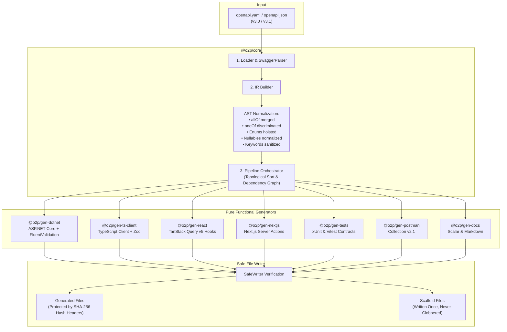

# openapi-to-production (`o2p`) ⚡

> **One `openapi.yaml` in → a production-grade, regenerable full-stack out.**  
> ASP.NET Core API, typed TypeScript client, TanStack React Query v5 hooks, Next.js Server Actions, DTOs, FluentValidation, xUnit contract tests, Postman collection, interactive documentation, and a realistic mock server.

[](https://github.com/almas-codes/openapi-to-production/actions)
[](https://opensource.org/licenses/MIT)
[](https://nodejs.org/)
[](https://dotnet.microsoft.com/)
[](https://www.typescriptlang.org/)
[](https://turbo.build/)

---

## What is `openapi-to-production` (`o2p`)?

**`o2p`** is a next-generation, type-safe full-stack code generator and developer toolchain built for modern engineering teams. 

Instead of treating API design as an afterthought or manually writing hundreds of repetitive C# controllers, DTOs, validation rules, TypeScript interfaces, fetch clients, React hooks, and test files for every endpoint, **`o2p` takes a single OpenAPI 3.0 / 3.1 specification (`openapi.yaml` or `openapi.json`) and instantly scaffolds and synchronizes your entire production architecture**.

Most importantly, `o2p` solves the **#1 problem with existing OpenAPI generators: safe regeneration**. You can add endpoints, change parameters, and rerun `o2p generate` at any point during development without ever clobbering or overwriting your hand-written business logic.

---

## Why I Built `o2p` (The Problem with NSwag & openapi-generator)

As software architects and engineers, we all want **API-first development**: design the contract first, get buy-in from frontend and backend, and write code against that single source of truth. But in practice, teams ditch code generators after sprint 2 because of four fatal flaws in legacy tools:

1. **The "Regeneration Trap" (Clobbering Custom Code):**  
   Legacy generators like NSwag or `openapi-generator` spit out concrete classes where business logic is supposed to live. The moment your OpenAPI spec changes in sprint 4 and you rerun the generator, git status lights up with 200 merge conflicts, or worse, your custom domain logic is completely wiped out.
2. **Disconnected Frontend & Backend Silos:**  
   Backend engineers use one generator (e.g., C# stubs), frontend engineers use another (e.g., Axios generator), and QA uses a third (Postman generator). Naming conventions diverge, enum casing breaks, and validation constraints on the server don't match the client schemas.
3. **Fragile Complex Schemas:**  
   Complex OpenAPI constructs — polymorphic `oneOf` with discriminators, `allOf` model inheritance, nullable primitives across OpenAPI 3.0 vs 3.1, and circular `$ref` schemas — frequently generate invalid syntax that fails at compilation.
4. **No Drift Detection in CI/CD:**  
   There has never been an easy way to verify in GitHub Actions whether a developer modified an endpoint by hand without updating the OpenAPI spec. Code and documentation silently drift apart.

### How `o2p` Solves This

`o2p` was built from the ground up to eliminate these problems with three core architectural pillars:
- **Unified Intermediate Representation (IR):** The raw OpenAPI AST is normalized once into a language-neutral IR. Every generator (C#, TypeScript, Postman, Docs) consumes the identical IR, guaranteeing 100% contract parity across your stack.
- **Hash-Protected Safe Regeneration:** Emitted files are strictly divided into `generated` (protected with SHA-256 headers) and `scaffold` (written once, owned by you forever).
- **Compile-Verified CI Pipeline:** `o2p check` runs in GitHub Actions to detect spec-code drift, and output is continuously validated with real `dotnet build`, `tsc`, and `vitest` runs.

---

## Feature Comparison Matrix

| Capability | Legacy Generators (NSwag / openapi-generator) | `o2p` (`openapi-to-production`) |
|---|---|---|
| **Architecture** | Language-specific mustache/liquid templates | **Single language-neutral Intermediate Representation (IR)** |
| **Regeneration Safety** | Blindly overwrites files; brittle manual merges | **Hash-Protected Safe Regeneration** (`generated` vs `scaffold`) |
| **Output Scope** | Client-only or server-only stubs | **Full-Stack** (ASP.NET Core + TS Client + React Query + Next.js + Tests + Docs + Mock) |
| **Backend Pattern** | Concrete controllers with stubs | **Abstract `ControllerBase` + `IService`** (Zero logic clobbered) |
| **Validation Parity** | Disconnected or missing | **FluentValidation (C#) & Zod (TS)** generated from identical constraints |
| **Spec-Code Drift Check** | None (manual audits) | **`o2p check`** (fails CI with exit code 1 if code drifts from spec) |
| **Breaking Change Analysis**| None | **`o2p diff old.yaml new.yaml`** (classifies breaking vs non-breaking changes) |
| **Instant Mock Server** | Requires external tools (Prism, WireMock) | **Built-in Fastify + Faker mock server** (`o2p mock`) |
| **Plugin Extensibility** | Complex Java/JAR plugins | **Pure TypeScript plugin API** (`defineGenerator` in 15 lines) |
| **Output Verification** | "Works on my machine" | **Compile-tested in CI** (`dotnet build`, `tsc --noEmit`, `vitest`) |

---

## What Gets Generated (The Full-Stack Output)

When you run `o2p generate`, here is the production-grade architecture that is produced:

```text
generated/
├── backend/Acme.Api/                     # Production ASP.NET Core API (.NET 10 / 9)
│   ├── Controllers/
│   │   ├── Generated/                    # [GENERATED] Abstract base controllers (Overwritten on regen)
│   │   │   ├── AuthControllerBase.cs
│   │   │   ├── ProductsControllerBase.cs
│   │   │   └── OrdersControllerBase.cs
│   │   ├── AuthController.cs             # [SCAFFOLD] Concrete controllers (Written ONCE — your code!)
│   │   ├── ProductsController.cs
│   │   └── OrdersController.cs
│   ├── Services/
│   │   ├── Generated/                    # [GENERATED] Service contracts (Overwritten on regen)
│   │   │   ├── IAuthService.cs
│   │   │   ├── IProductsService.cs
│   │   │   └── IOrdersService.cs
│   │   ├── AuthService.cs                # [SCAFFOLD] Concrete services with domain logic (Written ONCE!)
│   │   ├── ProductsService.cs
│   │   └── OrdersService.cs
│   ├── Models/
│   │   └── GeneratedModels.cs            # [GENERATED] Immutable C# records with [JsonPropertyName]
│   ├── Validators/
│   │   └── GeneratedValidators.cs        # [GENERATED] FluentValidation validators from OpenAPI constraints
│   ├── GeneratedApiExtensions.cs         # [GENERATED] AddGeneratedApi() dependency injection extension
│   ├── Acme.Commerce.Api.csproj          # [SCAFFOLD] Ready-to-run .NET project file
│   └── Program.cs                        # [SCAFFOLD] Configured ASP.NET Core entrypoint
├── frontend/api/                         # Typed TypeScript & React Ecosystem
│   ├── types.ts                          # [GENERATED] TypeScript interfaces + Zod schemas
│   ├── client.ts                         # [GENERATED] Fetch client with retries, auth tokens, ProblemDetails
│   ├── index.ts                          # [GENERATED] Clean barrel exports
│   ├── hooks/                            # [GENERATED] TanStack React Query v5 hooks
│   │   ├── context.tsx                   # ApiProvider and useApi context
│   │   ├── products.ts                   # useListProducts, useCreateProduct, query keys factory
│   │   └── orders.ts
│   └── next/                             # [GENERATED] Next.js App Router
│       └── actions.ts                    # 'use server' Server Actions wrappers
├── tests/                                # Automated Contract Tests
│   ├── dotnet/ApiContractTests.cs        # [GENERATED] xUnit WebApplicationFactory contract tests
│   └── vitest/client.contract.test.ts    # [GENERATED] Vitest client contract assertions
├── postman/                              # API Testing & Collaboration
│   ├── collection.json                   # [GENERATED] Postman v2.1 collection with assertions & auth
│   └── environment.json                  # [GENERATED] Postman environment with baseUrl & token
└── docs/                                 # Interactive Documentation
    ├── API.md                            # [GENERATED] Comprehensive markdown reference table
    └── index.html                        # [GENERATED] Standalone HTML embedding Scalar API Reference
```

---

## How Safe Regeneration Works: The Core Innovation

The fundamental reason developers abandon code generators is that **they don't know where the generator ends and the human begins**. `o2p` enforces an unbreakable boundary:

```
┌──────────────────────────────────────────────────────────────┐
│                    SAFE REGENERATION MODEL                   │
├──────────────────────────────┬───────────────────────────────┤
│    GENERATED FILES (80%)     │     SCAFFOLD FILES (20%)      │
│   (Managed by o2p Engine)    │     (Owned by Developer)      │
├──────────────────────────────┼───────────────────────────────┤
│ • Abstract Controller Bases  │ • Concrete Controllers        │
│ • Service Interfaces         │ • Domain Service Logic        │
│ • DTO Records & Models       │ • Custom Middlewares          │
│ • FluentValidation Rules     │ • Entity Framework Mappings   │
│ • TypeScript & Zod Schemas   │ • Database Contexts           │
│ • React Query Key Factories  │ • Program.cs & .csproj        │
│ • Postman Collections & Docs │ • UI Components & Pages       │
├──────────────────────────────┼───────────────────────────────┤
│ Rule: Always overwritten on  │ Rule: Written once on initial │
│ regen. SHA-256 hash verified │ scaffold. NEVER overwritten   │
│ to detect manual edits.      │ by subsequent runs.           │
└──────────────────────────────┴───────────────────────────────┘
```

### 1. SHA-256 Hash Headers
Every generated file starts with a cryptographic signature:
```csharp
// auto-generated by openapi-to-production. DO NOT EDIT. o2p-hash:3a7d91e84f02b1c4
```
When `o2p generate` runs:
- If the file is identical: Marked as `unchanged` (zero unnecessary disk writes or IDE rebuild triggers).
- If the spec changed: Updates the file cleanly with a new hash.
- **If a developer edited the file by hand:** The body hash no longer matches the header! `o2p` detects the conflict, warns you with `⚠ conflict: file was modified by user`, and **refuses to overwrite it** unless you explicitly pass `--force`.

### 2. The Abstract Controller & Service Pattern (C#)
Your business logic never lives in the controller. `o2p` generates an abstract controller that binds routes and delegates to an injected interface:

```csharp
// GENERATED (Controllers/Generated/ProductsControllerBase.cs) — Regenerated on spec change
[ApiController]
[Route("api/[controller]")]
public abstract class ProductsControllerBase(IProductsService service) : ControllerBase
{
    [HttpGet]
    [ProducesResponseType(typeof(PaginatedProducts), StatusCodes.Status200OK)]
    public virtual async Task<ActionResult<PaginatedProducts>> ListProducts(
        [FromQuery] int? page, [FromQuery] int? pageSize, CancellationToken ct)
        => Ok(await service.ListProductsAsync(page, pageSize, ct));
}
```

You implement your business logic in the concrete service class, which is **scaffolded once and never touched again**:

```csharp
// SCAFFOLD (Services/ProductsService.cs) — Written once. YOUR BUSINESS LOGIC IS SAFE HERE!
namespace Acme.Commerce.Api.Services;

public class ProductsService(AppDbContext db, ILogger<ProductsService> logger) : IProductsService
{
    public async Task<PaginatedProducts> ListProductsAsync(int? page, int? pageSize, CancellationToken ct)
    {
        var query = db.Products.AsNoTracking();
        var items = await query.Skip(((page ?? 1) - 1) * (pageSize ?? 20)).Take(pageSize ?? 20).ToListAsync(ct);
        return new PaginatedProducts(Total: await query.CountAsync(ct), Page: page ?? 1, Items: items);
    }
}
```

When you add a new endpoint `/products/search` to your OpenAPI spec next month:
1. `IProductsService` receives the new method signature.
2. `ProductsControllerBase` receives the new route action.
3. The C# compiler tells you where you need to implement the new method in `ProductsService.cs`.
4. **Zero lines of existing code are destroyed.**

---

## 30-Second Quickstart

### Step 1: Install & Initialize
In your terminal, run:
```bash
npx @o2p/cli init
```
The interactive Clack prompt will ask for your OpenAPI file and target frameworks, creating your `o2p.config.ts`:

```typescript
import { defineConfig } from '@o2p/core';
import dotnet from '@o2p/gen-dotnet';
import tsClient from '@o2p/gen-ts-client';
import react from '@o2p/gen-react';
import nextjs from '@o2p/gen-nextjs';
import tests from '@o2p/gen-tests';
import postman from '@o2p/gen-postman';
import docs from '@o2p/gen-docs';

export default defineConfig({
  input: './openapi.yaml',
  generators: [
    dotnet({ out: './backend/src/Api', namespace: 'Acme.Commerce.Api', framework: 'net10.0' }),
    tsClient({ out: './frontend/src/api', zod: true, baseUrlEnv: 'VITE_API_URL' }),
    react({ out: './frontend/src/api/hooks', queryLib: 'tanstack-v5' }),
    nextjs({ out: './frontend/src/api/next', actions: true }),
    tests({ out: './tests', target: 'both' }),
    postman({ out: './postman' }),
    docs({ out: './docs/api' }),
  ],
});
```

### Step 2: Generate the Full-Stack
```bash
npx o2p generate
```
Output:
```text
⚡ openapi-to-production (o2p)
✔ Loaded ./openapi.yaml (38 operations, 52 schemas)
✔ Generation complete: 32 created, 0 updated, 0 unchanged, 0 conflicts.
```

### Step 3: Start the Instant Mock Server
Frontend team waiting on the backend? Spin up a mock server with seeded fake data and real schema validation:
```bash
npx o2p mock --port 4010 --delay 200
```
- Listens at `http://localhost:4010`
- Realistic fake data generated using `@faker-js/faker` matching schema constraints (`format: email`, `format: uuid`, `minimum`, `maximum`)
- Pass `x-mock-status: 400` or `x-mock-status: 500` header in any request to simulate error edge cases
- View normalized IR schema at `http://localhost:4010/__spec`

---

## Complete CLI Command Reference

`o2p` comes with an enterprise CLI designed for developer workflows and CI/CD automation:

| Command | Syntax | Description | Exit Codes |
|---|---|---|---|
| **`init`** | `o2p init` | Interactive terminal wizard to configure `o2p.config.ts`. | `0`: Success |
| **`generate`** | `o2p generate` | Runs the generator pipeline. Supports `--force` (overwrite conflicts) and `--dry-run`. | `0`: Success, `1`: Error |
| **`watch`** | `o2p generate --watch` | Watches your `openapi.yaml` and regenerates your entire stack instantly on save. | Ongoing |
| **`check`** | `o2p check` | **CI drift detector.** Dry-runs the pipeline and checks if any generated file would change. | `0`: In sync, `1`: Drift detected |
| **`mock`** | `o2p mock --port 4010` | Launches the Fastify mock server with simulated delays (`--delay 200`). | Ongoing |
| **`lint`** | `o2p lint [spec]` | Audits spec quality: missing `operationId`, missing descriptions, or duplicate paths. | `0`: Clean, `2`: Lint error |
| **`diff`** | `o2p diff v1.yaml v2.yaml` | Analyzes breaking changes (removed operations, added required parameters). | `0`: Safe, `1`: Breaking changes |

---

## CI/CD Automation & GitHub Action

Stop OpenAPI spec drift from reaching production. Add this lightweight check to your pull request workflow:

```yaml
# .github/workflows/api-contract.yml
name: API Contract Verification
on: [pull_request]

jobs:
  verify:
    runs-on: ubuntu-latest
    steps:
      - uses: actions/checkout@v4
      - uses: pnpm/action-setup@v4
      - uses: actions/setup-node@v4
        with:
          node-version: 20
          cache: pnpm

      - run: pnpm install --frozen-lockfile
      - name: Verify Spec Parity (No Drift)
        run: npx o2p check

      - name: Lint OpenAPI Spec Quality
        run: npx o2p lint ./openapi.yaml
```

If a developer changes the backend or frontend without updating the OpenAPI specification, **`o2p check` fails the build immediately with exit code 1**.

---

## Authoring Custom Plugins in 15 Lines

Need to generate something unique — like Terraform routes, GraphQL schemas, or a Python client? `o2p` exposes a pure functional plugin API. Every generator receives the normalized IR (`ApiSpec`) and returns an array of files:

```typescript
import { defineGenerator, type GeneratorContext } from '@o2p/core';
import { z } from 'zod';

const optionsSchema = z.object({
  out: z.string().default('./docs'),
});

export default defineGenerator({
  name: 'endpoint-summary',
  optionsSchema,
  async generate({ spec }: GeneratorContext<z.infer<typeof optionsSchema>>) {
    const markdown = `# API Index: ${spec.info.title}\n\n` +
      spec.operations.map(op => `- **${op.method.toUpperCase()}** \`${op.path}\` — ${op.summary}`).join('\n');

    return [
      {
        path: 'ENDPOINTS.md',
        content: markdown,
        kind: 'generated', // Handled by SafeWriter with SHA-256 header
      },
    ];
  },
});
```

Plug it into your `o2p.config.ts` and it participates in the topological build pipeline, collision detection, and safe writing automatically.

---

## Architecture Diagram (Mermaid)



---

## Monorepo Layout

```
openapi-to-production/
├── packages/
│   ├── core/           # Intermediate Representation (IR), Loader, Pipeline, SafeWriter
│   ├── cli/            # 'o2p' CLI binary (init, generate, check, mock, lint, diff)
│   ├── gen-dotnet/     # ASP.NET Core API, DTOs, FluentValidation, Clean Architecture
│   ├── gen-ts-client/  # Strict TypeScript client, runtime Zod schemas, ProblemDetails
│   ├── gen-react/      # TanStack React Query v5 hooks, Query Key factories
│   ├── gen-nextjs/     # Next.js App Router Server Actions ('use server')
│   ├── gen-tests/      # xUnit WebApplicationFactory & Vitest contract test suite
│   ├── gen-postman/    # Postman v2.1 Collection & Environment generator
│   ├── gen-docs/       # Markdown tables & Standalone HTML Scalar documentation
│   └── mock-server/    # Fastify mock server with @faker-js/faker realistic fixtures
├── examples/
│   ├── petstore/       # Classic Petstore benchmark specification
│   └── ecommerce/      # High-scale ecommerce API (Auth, Uploads, Polymorphism, Pagination)
├── docs/adr/           # Architecture Decision Records (ADR-001 through ADR-005)
├── o2p.config.ts       # Self-hosting dogfood configuration
└── turbo.json          # Turborepo build pipeline
```

---

## Contributing & Development

```bash
# Clone the repository
git clone https://github.com/almas-codes/openapi-to-production.git
cd openapi-to-production

# Install dependencies
pnpm install

# Build all packages
pnpm build

# Run unit and snapshot test suites
pnpm test
```

Please review [CONTRIBUTING.md](./CONTRIBUTING.md) and [SECURITY.md](./SECURITY.md) before opening pull requests.

---

## License

Released under the **MIT License**.  
Crafted with passion by **Almas Khan** ([@almas-codes](https://github.com/almas-codes)) — [almaskhanwazir@gmail.com](mailto:almaskhanwazir@gmail.com).
